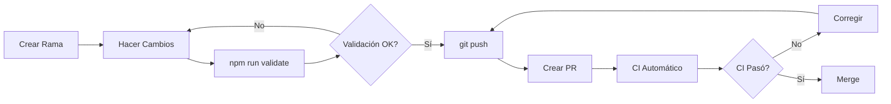
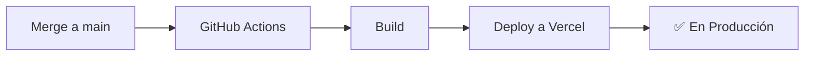

# 📚 Documentación de CI/CD y Workflows

Bienvenido a la documentación de los procesos automatizados del proyecto.

## 📂 Contenido

### 🚀 [Pipeline CI/CD](workflows/PIPELINE_README.md)
Documentación completa del pipeline de integración continua:
- Qué valida el pipeline
- Cómo funciona
- Configuración de secrets
- Comandos para ejecutar localmente
- Debugging y solución de problemas

### 🔒 [Guía de Protección de Ramas](BRANCH_PROTECTION_GUIDE.md)
Guía paso a paso para configurar las protecciones de rama en GitHub:
- Configurar reglas de protección para `main`
- Requerir que el CI pase antes del merge
- Flujo de trabajo completo con PRs
- Solución de problemas comunes

### 🚀 [Guía de Deployment en Vercel](VERCEL_DEPLOYMENT_GUIDE.md)
Guía completa para configurar deployment automático a Vercel:
- Configurar proyecto en Vercel
- Obtener y configurar tokens necesarios
- Deployment automático después de merge a `main`
- Variables de entorno y dominios personalizados
- Troubleshooting y mejores prácticas

### 📋 [Template de Pull Request](PULL_REQUEST_TEMPLATE.md)
Template automático para crear Pull Requests consistentes.

## ⚡ Inicio Rápido

### Para Desarrolladores

```bash
# Antes de crear un PR, ejecuta:
npm run validate

# Esto ejecuta:
# - ESLint (linting)
# - TypeScript (type checking)
# - Tests (todas las pruebas unitarias)
```

### Para Configurar el Repositorio

1. **Configurar Secrets** (si aún no están):
   - Ve a Settings → Secrets and variables → Actions
   - Agrega `VITE_SUPABASE_URL` y `VITE_SUPABASE_ANON_KEY`

2. **Configurar Protección de Ramas**:
   - Sigue la [Guía de Protección de Ramas](BRANCH_PROTECTION_GUIDE.md)
   - Esto asegura que solo los PRs que pasen el CI puedan hacer merge

## 🔄 Flujo de Trabajo



## ✅ Validaciones y Deployment Automáticos

### En Pull Requests (CI)

| Check | Descripción | Bloquea Merge |
|-------|-------------|---------------|
| 🔍 ESLint | Verifica calidad de código | ✅ Sí |
| 🔷 TypeScript | Verifica tipos | ✅ Sí |
| 🧪 Tests | Ejecuta tests unitarios | ✅ Sí |
| 🏗️ Build | Verifica compilación | ✅ Sí |
| 🔒 Security | Auditoría de seguridad | ⚠️ No |
| 📊 Coverage | Reporte de cobertura | ⚠️ No |

### Después de Merge a `main` (CD)

| Paso | Descripción | Tiempo |
|------|-------------|--------|
| 🏗️ Build | Compilación del proyecto | ~1-2 min |
| 🚀 Deploy | Deployment a Vercel | ~30-60 seg |
| ✅ Live | App en producción | Total: ~2-3 min |

## 🎯 Estándares del Proyecto

### Cobertura de Código
- Mínimo requerido: **70%** en líneas, funciones, branches y statements
- Configurado en `vitest.config.ts`

### ESLint
- Máximo 10 warnings permitidos
- 0 errores permitidos

### TypeScript
- Modo estricto habilitado
- 0 errores de tipos

## 🆘 Ayuda Rápida

### El CI está fallando

1. **Ver los logs**:
   - Ve a tu PR en GitHub
   - Haz clic en "Details" junto al check fallido
   - Lee el error

2. **Reproducir localmente**:
   ```bash
   npm run validate
   ```

3. **Corregir y volver a intentar**:
   ```bash
   git add .
   git commit -m "fix: corregir error del CI"
   git push
   ```

### No puedo hacer merge

- **Causa**: El CI no ha pasado o falta aprobación
- **Solución**: 
  1. Verifica que todos los checks estén en verde ✅
  2. Si hay checks requeridos pendientes, espera a que terminen
  3. Si faltan aprobaciones, pide review

### El CI está tardando mucho

- **Tiempo normal**: 2-5 minutos
- **Si tarda más**: Puede ser carga del servidor de GitHub
- **Solución**: Espera o cancela y vuelve a ejecutar

## 🚀 Deployment

El proyecto se despliega automáticamente a Vercel después de cada merge a `main`.

### Configuración Inicial

Para configurar el deployment automático, sigue estos pasos:

1. **Crea un proyecto en Vercel** (si no existe)
2. **Obtén los tokens necesarios**:
   - Vercel Token
   - Organization ID
   - Project ID
3. **Configura los secrets en GitHub**:
   - `VERCEL_TOKEN`
   - `VERCEL_ORG_ID`
   - `VERCEL_PROJECT_ID`
   - `VITE_SUPABASE_URL`
   - `VITE_SUPABASE_ANON_KEY`

📖 **Guía completa**: [VERCEL_DEPLOYMENT_GUIDE.md](VERCEL_DEPLOYMENT_GUIDE.md)

### Flujo de Deployment



## 📈 Mejoras Futuras

- [ ] Tests E2E con Playwright
- [ ] Análisis de bundle size
- [ ] Lighthouse CI para performance
- [x] Deploy automático a producción
- [ ] Preview deployments para PRs
- [ ] Notificaciones en Slack

## 📞 Soporte

- **Documentación del Pipeline**: [PIPELINE_README.md](workflows/PIPELINE_README.md)
- **Guía de Protección**: [BRANCH_PROTECTION_GUIDE.md](BRANCH_PROTECTION_GUIDE.md)
- **Guía de Deployment**: [VERCEL_DEPLOYMENT_GUIDE.md](VERCEL_DEPLOYMENT_GUIDE.md)
- **Issues**: [GitHub Issues](https://github.com/camiloramosm/taller1_frontend/issues)

---

**Última actualización**: Noviembre 2024  
**Mantenedor**: @camiloramosm

